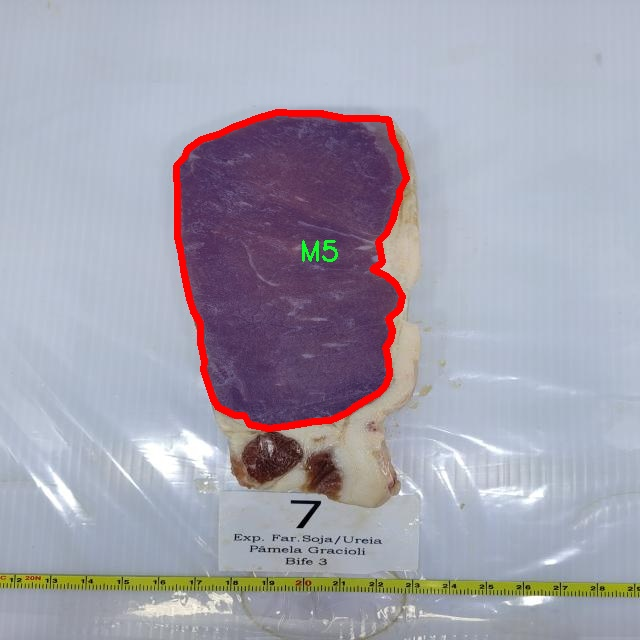

### 1.背景意义

研究背景与意义

随着全球肉类消费的不断增长，牛肉的质量与安全性问题日益受到关注。牛肉分级不仅影响消费者的购买决策，还直接关系到肉类市场的经济效益。因此，建立一个高效、准确的牛肉分级识别系统，能够为牛肉产业链的各个环节提供重要的技术支持，提升产品质量与市场竞争力。传统的牛肉分级方法多依赖人工评估，效率低下且主观性强，容易受到评估者经验和判断的影响，导致分级结果的不一致性和不准确性。

近年来，计算机视觉技术的迅猛发展为牛肉分级提供了新的解决方案。基于深度学习的图像分割技术，尤其是YOLO（You Only Look Once）系列模型，因其在实时物体检测和分割任务中的优越性能，成为研究的热点。YOLOv11作为该系列的最新版本，具备更高的检测精度和更快的处理速度，能够有效应对复杂的牛肉图像特征，进而实现准确的分级识别。

本研究基于改进的YOLOv11模型，构建一个牛肉分级识别图像分割系统，旨在通过深度学习技术对牛肉进行自动化分级。数据集包含五个类别（M2、M3、M4、M5、M6），并通过高质量的图像和精确的标注，确保模型训练的有效性。通过对193幅图像的处理与分析，系统能够实现对牛肉质量的快速、准确评估，进而为牛肉产业的智能化发展提供支持。

综上所述，本研究不仅具有重要的理论意义，推动了计算机视觉技术在农业领域的应用，同时也为牛肉产业的现代化管理提供了实用的技术手段，助力提升整体行业的生产效率与产品质量。

### 2.视频效果

[2.1 视频效果](https://www.bilibili.com/video/BV1CqU6YSEmB/)

### 3.图片效果


##### [项目涉及的源码数据来源链接](https://kdocs.cn/l/cszuIiCKVNis)**

注意：本项目提供训练的数据集和训练教程,由于版本持续更新,暂不提供权重文件（best.pt）,请按照6.训练教程进行训练后实现上图演示的效果。

### 4.数据集信息

##### 4.1 本项目数据集类别数＆类别名

nc: 5
names: ['M2', 'M3', 'M4', 'M5', 'M6']


该项目为【图像分割】数据集，请在【训练教程和Web端加载模型教程（第三步）】这一步的时候按照【图像分割】部分的教程来训练

##### 4.2 本项目数据集信息介绍

本项目数据集信息介绍

本项目所使用的数据集以“IMF - BEEF”为主题，旨在为改进YOLOv11的牛肉分级识别图像分割系统提供强有力的支持。该数据集包含五个主要类别，分别为M2、M3、M4、M5和M6，涵盖了牛肉分级的不同层次。这些类别代表了牛肉在市场上的不同品质等级，具体包括M2（优质）、M3（良好）、M4（中等）、M5（较差）和M6（低质）。每个类别的图像样本均经过精心挑选和标注，以确保数据的准确性和代表性，从而为模型的训练提供高质量的输入。

数据集的构建过程中，考虑到了牛肉分级的实际应用场景，采集了多种角度和光照条件下的牛肉图像，以增强模型的鲁棒性和泛化能力。这些图像不仅展示了牛肉的外观特征，还包含了与分级相关的细微差别，如纹理、颜色和脂肪分布等。这些特征在牛肉分级中起着至关重要的作用，因此，数据集中的图像将为YOLOv11模型的训练提供丰富的信息来源。

此外，数据集的规模和多样性也经过精心设计，以确保模型能够在不同的实际应用环境中表现出色。通过对牛肉图像进行标注和分类，研究团队能够有效地训练出一个高效的图像分割系统，进而提升牛肉分级的自动化程度和准确性。最终，本项目的数据集将为牛肉分级的智能化提供坚实的基础，推动相关领域的技术进步和应用发展。




### 5.全套项目环境部署视频教程（零基础手把手教学）

[5.1 所需软件PyCharm和Anaconda安装教程（第一步）](https://www.bilibili.com/video/BV1BoC1YCEKi/?spm_id_from=333.999.0.0&vd_source=bc9aec86d164b67a7004b996143742dc)


[5.2 安装Python虚拟环境创建和依赖库安装视频教程（第二步）](https://www.bilibili.com/video/BV1ZoC1YCEBw?spm_id_from=333.788.videopod.sections&vd_source=bc9aec86d164b67a7004b996143742dc)

### 6.改进YOLOv11训练教程和Web_UI前端加载模型教程（零基础手把手教学）

[6.1 改进YOLOv11训练教程和Web_UI前端加载模型教程（第三步）](https://www.bilibili.com/video/BV1BoC1YCEhR?spm_id_from=333.788.videopod.sections&vd_source=bc9aec86d164b67a7004b996143742dc)


按照上面的训练视频教程链接加载项目提供的数据集，运行train.py即可开始训练



     Epoch   gpu_mem       box       obj       cls    labels  img_size
     1/200     20.8G   0.01576   0.01955  0.007536        22      1280: 100%|██████████| 849/849 [14:42<00:00,  1.04s/it]
               Class     Images     Labels          P          R     mAP@.5 mAP@.5:.95: 100%|██████████| 213/213 [01:14<00:00,  2.87it/s]
                 all       3395      17314      0.994      0.957      0.0957      0.0843

     Epoch   gpu_mem       box       obj       cls    labels  img_size
     2/200     20.8G   0.01578   0.01923  0.007006        22      1280: 100%|██████████| 849/849 [14:44<00:00,  1.04s/it]
               Class     Images     Labels          P          R     mAP@.5 mAP@.5:.95: 100%|██████████| 213/213 [01:12<00:00,  2.95it/s]
                 all       3395      17314      0.996      0.956      0.0957      0.0845

     Epoch   gpu_mem       box       obj       cls    labels  img_size
     3/200     20.8G   0.01561    0.0191  0.006895        27      1280: 100%|██████████| 849/849 [10:56<00:00,  1.29it/s]
               Class     Images     Labels          P          R     mAP@.5 mAP@.5:.95: 100%|███████   | 187/213 [00:52<00:00,  4.04it/s]
                 all       3395      17314      0.996      0.957      0.0957      0.0845


###### [项目数据集下载链接](https://kdocs.cn/l/cszuIiCKVNis)

### 7.原始YOLOv11算法讲解


YOLO11 是 Ultralytics YOLO 系列的最新版本，结合了尖端的准确性、速度和效率，用于目标检测、分割、分类、定向边界框和姿态估计。与
YOLOv8 相比，它具有更少的参数和更好的结果，不难预见，YOLO11 在边缘设备上更高效、更快，将频繁出现在计算机视觉领域的最先进技术（SOTA）中。


**主要特点**

  * **增强的特征提取：**YOLO11 使用改进的主干和颈部架构来增强特征提取，以实现更精确的目标检测和复杂任务的性能。

  * **针对效率和速度优化：**精细的架构设计和优化的训练流程在保持准确性和性能之间最佳平衡的同时，提供更快的处理速度。

  * **更少的参数，更高的准确度：**YOLO11m 在 COCO 数据集上实现了比 YOLOv8m 更高的 mAP，参数减少了 22%，提高了计算效率，同时不牺牲准确度。

  * **跨环境的适应性：**YOLO11 可以无缝部署在边缘设备、云平台和配备 NVIDIA GPU 的系统上，确保最大的灵活性。

  * **支持广泛的任务范围：**YOLO11 支持各种计算机视觉任务，如目标检测、实例分割、图像分类、姿态估计和定向目标检测（OBB）。


### 8.200+种全套改进YOLOV11创新点原理讲解

#### 8.1 200+种全套改进YOLOV11创新点原理讲解大全

由于篇幅限制，每个创新点的具体原理讲解就不全部展开，具体见下列网址中的改进模块对应项目的技术原理博客网址【Blog】（创新点均为模块化搭建，原理适配YOLOv5~YOLOv11等各种版本）

[改进模块技术原理博客【Blog】网址链接](https://gitee.com/qunmasj/good)


#### 8.2 精选部分改进YOLOV11创新点原理讲解

###### 这里节选部分改进创新点展开原理讲解(完整的改进原理见上图和[改进模块技术原理博客链接](https://gitee.com/qunmasj/good)【如果此小节的图加载失败可以通过CSDN或者Github搜索该博客的标题访问原始博客，原始博客图片显示正常】
### CBAM空间注意力机制
近年来，随着深度学习研究方向的火热，注意力机制也被广泛地应用在图像识别、语音识别和自然语言处理等领域，注意力机制在深度学习任务中发挥着举足轻重的作用。注意力机制借鉴于人类的视觉系统，例如，人眼在看到一幅画面时，会倾向于关注画面中的重要信息，而忽略其他可见的信息。深度学习中的注意力机制和人类视觉的注意力机制相似，通过扫描全局数据，从大量数据中选择出需要重点关注的、对当前任务更为重要的信息，然后对这部分信息分配更多的注意力资源，从这些信息中获取更多所需要的细节信息，而抑制其他无用的信息。而在深度学习中，则具体表现为给感兴趣的区域更高的权重，经过网络的学习和调整，得到最优的权重分配，形成网络模型的注意力，使网络拥有更强的学习能力，加快网络的收敛速度。
注意力机制通常可分为软注意力机制和硬注意力机制[4-5]。软注意力机制在选择信息时，不是从输入的信息中只选择1个，而会用到所有输入信息，只是各个信息对应的权重分配不同，然后输入网络模型进行计算;硬注意力机制则是从输入的信息中随机选取一个或者选择概率最高的信息，但是这一步骤通常是不可微的，导致硬注意力机制更难训练。因此，软注意力机制应用更为广泛，按照原理可将软注意力机制划分为:通道注意力机制（channel attention)、空间注意力机制(spatial attention）和混合域注意力机制(mixed attention)。
通道注意力机制的本质建立各个特征通道之间的重要程度，对感兴趣的通道进行重点关注，弱化不感兴趣的通道的作用;空间注意力的本质则是建模了整个空间信息的重要程度，然后对空间内感兴趣的区域进行重点关注，弱化其余非感兴趣区域的作用;混合注意力同时运用了通道注意力和空间注意力，两部分先后进行或并行，形成对通道特征和空间特征同时关注的注意力模型。

卷积层注意力模块(Convolutional Block Attention Module，CBAM）是比较常用的混合注意力模块，其先后集中了通道注意力模块和空间注意力模块，网络中加入该模块能有效提高网络性能，减少网络模型的计算量，模块结构如图所示。输入特征图首先经过分支的通道注意力模块，然后和主干的原特征图融合，得到具有通道注意力的特征图，接着经过分支的空间注意力模块，在和主干的特征图融合后，得到同时具有通道特征注意力和空间特征注意力的特征图。CBAM模块不改变输入特征图的大小，因此该模块是一个“即插即用”的模块，可以插入网络的任何位置。

通道注意力模块的结构示意图如图所示，通道注意力模块分支并行地对输入的特征图进行最大池化操作和平均池化操作，然后利用多层感知机对结果进行变换，得到应用于两个通道的变换结果，最后经过sigmoid激活函数将变换结果融合，得到具有通道注意力的通道特征图。

空间注意力模块示意图如图所示，将通道注意力模块输出的特征图作为该模块的输入特征图，首先对输入特征图进行基于通道的最大池化操作和平均池化操作，将两部分得到的结果拼接起来，然后通过卷积得到降为Ⅰ通道的特征图，最后通过sigmoid激活函数生成具有空间注意力的特征图。


### 9.系统功能展示

图9.1.系统支持检测结果表格显示

  图9.2.系统支持置信度和IOU阈值手动调节

  图9.3.系统支持自定义加载权重文件best.pt(需要你通过步骤5中训练获得)

  图9.4.系统支持摄像头实时识别

  图9.5.系统支持图片识别

  图9.6.系统支持视频识别

  图9.7.系统支持识别结果文件自动保存

  图9.8.系统支持Excel导出检测结果数据


### 10. YOLOv11核心改进源码讲解

#### 10.1 fadc.py

以下是对代码中最核心部分的提炼和详细注释。主要包括`OmniAttention`类、`FrequencySelection`类和`AdaptiveDilatedConv`类。其他辅助函数和类被省略以保持核心代码的简洁性。

```python
import torch
import torch.nn as nn
import torch.nn.functional as F

class OmniAttention(nn.Module):
    """OmniAttention类实现了全局注意力机制，主要用于通道、过滤器、空间和内核的注意力计算。"""

    def __init__(self, in_planes, out_planes, kernel_size, groups=1, reduction=0.0625, kernel_num=4, min_channel=16):
        super(OmniAttention, self).__init__()
        # 计算注意力通道数
        attention_channel = max(int(in_planes * reduction), min_channel)
        self.kernel_size = kernel_size
        self.kernel_num = kernel_num
        self.temperature = 1.0  # 温度参数用于控制注意力的平滑度

        # 定义用于计算通道注意力的层
        self.avgpool = nn.AdaptiveAvgPool2d(1)
        self.fc = nn.Conv2d(in_planes, attention_channel, 1, bias=False)
        self.bn = nn.BatchNorm2d(attention_channel)
        self.relu = nn.ReLU(inplace=True)

        # 定义其他注意力机制的层
        self.channel_fc = nn.Conv2d(attention_channel, in_planes, 1, bias=True)
        self.func_channel = self.get_channel_attention

        if in_planes == groups and in_planes == out_planes:  # 深度卷积
            self.func_filter = self.skip
        else:
            self.filter_fc = nn.Conv2d(attention_channel, out_planes, 1, bias=True)
            self.func_filter = self.get_filter_attention

        if kernel_size == 1:  # 点卷积
            self.func_spatial = self.skip
        else:
            self.spatial_fc = nn.Conv2d(attention_channel, kernel_size * kernel_size, 1, bias=True)
            self.func_spatial = self.get_spatial_attention

        if kernel_num == 1:
            self.func_kernel = self.skip
        else:
            self.kernel_fc = nn.Conv2d(attention_channel, kernel_num, 1, bias=True)
            self.func_kernel = self.get_kernel_attention

        self._initialize_weights()  # 初始化权重

    def _initialize_weights(self):
        """初始化卷积层和批归一化层的权重"""
        for m in self.modules():
            if isinstance(m, nn.Conv2d):
                nn.init.kaiming_normal_(m.weight, mode='fan_out', nonlinearity='relu')
                if m.bias is not None:
                    nn.init.constant_(m.bias, 0)
            if isinstance(m, nn.BatchNorm2d):
                nn.init.constant_(m.weight, 1)
                nn.init.constant_(m.bias, 0)

    @staticmethod
    def skip(_):
        """跳过函数，返回1.0"""
        return 1.0

    def get_channel_attention(self, x):
        """计算通道注意力"""
        channel_attention = torch.sigmoid(self.channel_fc(x).view(x.size(0), -1, 1, 1) / self.temperature)
        return channel_attention

    def get_filter_attention(self, x):
        """计算过滤器注意力"""
        filter_attention = torch.sigmoid(self.filter_fc(x).view(x.size(0), -1, 1, 1) / self.temperature)
        return filter_attention

    def get_spatial_attention(self, x):
        """计算空间注意力"""
        spatial_attention = self.spatial_fc(x).view(x.size(0), 1, 1, 1, self.kernel_size, self.kernel_size)
        spatial_attention = torch.sigmoid(spatial_attention / self.temperature)
        return spatial_attention

    def get_kernel_attention(self, x):
        """计算内核注意力"""
        kernel_attention = self.kernel_fc(x).view(x.size(0), -1, 1, 1, 1, 1)
        kernel_attention = F.softmax(kernel_attention / self.temperature, dim=1)
        return kernel_attention

    def forward(self, x):
        """前向传播，计算各类注意力"""
        x = self.avgpool(x)  # 全局平均池化
        x = self.fc(x)  # 通过全连接层
        x = self.bn(x)  # 批归一化
        x = self.relu(x)  # 激活函数
        return self.func_channel(x), self.func_filter(x), self.func_spatial(x), self.func_kernel(x)


class FrequencySelection(nn.Module):
    """FrequencySelection类用于选择频率特征并应用注意力机制。"""

    def __init__(self, in_channels, k_list=[2], lowfreq_att=True, fs_feat='feat', lp_type='freq', act='sigmoid', spatial='conv', spatial_group=1):
        super().__init__()
        self.k_list = k_list  # 频率列表
        self.lp_list = nn.ModuleList()  # 存储不同频率的池化层
        self.freq_weight_conv_list = nn.ModuleList()  # 存储频率权重卷积层
        self.in_channels = in_channels
        self.lowfreq_att = lowfreq_att

        # 定义频率权重卷积层
        for i in range(len(k_list) + (1 if lowfreq_att else 0)):
            freq_weight_conv = nn.Conv2d(in_channels, spatial_group, kernel_size=3, padding=1, groups=spatial_group, bias=True)
            self.freq_weight_conv_list.append(freq_weight_conv)

        # 定义不同类型的池化层
        if lp_type == 'avgpool':
            for k in k_list:
                self.lp_list.append(nn.AvgPool2d(kernel_size=k, stride=1, padding=0))

    def sp_act(self, freq_weight):
        """应用激活函数"""
        if self.act == 'sigmoid':
            freq_weight = freq_weight.sigmoid() * 2
        elif self.act == 'softmax':
            freq_weight = freq_weight.softmax(dim=1) * freq_weight.shape[1]
        return freq_weight

    def forward(self, x):
        """前向传播，计算频率选择和注意力"""
        x_list = []
        pre_x = x
        b, _, h, w = x.shape
        for idx, avg in enumerate(self.lp_list):
            low_part = avg(x)  # 低频部分
            high_part = pre_x - low_part  # 高频部分
            pre_x = low_part
            freq_weight = self.freq_weight_conv_list[idx](x)  # 计算频率权重
            freq_weight = self.sp_act(freq_weight)  # 应用激活函数
            x_list.append(freq_weight * high_part)  # 结合高频部分
        if self.lowfreq_att:
            freq_weight = self.freq_weight_conv_list[len(x_list)](x)
            x_list.append(freq_weight * pre_x)  # 结合低频部分
        else:
            x_list.append(pre_x)
        return sum(x_list)  # 返回所有部分的和


class AdaptiveDilatedConv(nn.Module):
    """AdaptiveDilatedConv类实现了可调的膨胀卷积，结合了频率选择和注意力机制。"""

    def __init__(self, in_channels, out_channels, kernel_size, stride=1, padding=1, dilation=1):
        super().__init__()
        self.conv = nn.Conv2d(in_channels, out_channels, kernel_size, stride=stride, padding=padding, dilation=dilation)
        self.frequency_selection = FrequencySelection(in_channels)  # 初始化频率选择模块

    def forward(self, x):
        """前向传播，执行卷积和频率选择"""
        x = self.frequency_selection(x)  # 选择频率特征
        x = self.conv(x)  # 执行卷积
        return x
```

### 代码核心部分说明
1. **OmniAttention**: 该类实现了多种注意力机制，包括通道、过滤器、空间和内核注意力。通过全局平均池化和一系列卷积层来计算注意力权重，并在前向传播中返回这些权重。

2. **FrequencySelection**: 该类用于选择特定频率的特征，并通过卷积层计算频率权重。它支持不同类型的池化操作，以提取低频和高频特征。

3. **AdaptiveDilatedConv**: 该类封装了可调的膨胀卷积，结合了频率选择模块。通过卷积操作和频率选择来处理输入特征。

这些核心部分构成了整个模型的基础，能够实现复杂的特征提取和注意力机制。

这个 `fadc.py` 文件包含了多个深度学习模型的实现，主要是基于 PyTorch 框架。文件中定义了几个类，包括 `OmniAttention`、`FrequencySelection`、`AdaptiveDilatedConv` 和 `AdaptiveDilatedDWConv`，它们都涉及到卷积操作和注意力机制。以下是对这些类的逐一分析和说明。

首先，`OmniAttention` 类实现了一种全局注意力机制。它的构造函数接收多个参数，包括输入和输出通道数、卷积核大小、分组数、通道缩减比例等。该类的核心在于计算通道注意力、过滤器注意力、空间注意力和卷积核注意力。它通过自适应平均池化、全连接层和卷积层来实现这些注意力机制，并在前向传播中计算这些注意力权重。该类还包含了权重初始化和温度更新的方法。

接下来，`generate_laplacian_pyramid` 函数用于生成拉普拉斯金字塔，它可以用于图像处理中的多尺度特征提取。该函数接收输入张量、金字塔层数和其他参数，逐层下采样并计算拉普拉斯差分，最终返回金字塔的各层特征。

`FrequencySelection` 类实现了一种频率选择机制，允许对输入特征进行频率域的处理。它支持多种操作模式，包括平均池化和拉普拉斯金字塔等。该类的构造函数接收输入通道数、频率列表、空间卷积参数等，并根据这些参数初始化多个卷积层。它的前向传播方法根据不同的模式计算频率选择的特征。

`AdaptiveDilatedConv` 类是一个可调节的膨胀卷积层，继承自 `ModulatedDeformConv2d`。它支持多种卷积类型和频率选择机制，并通过注意力机制来调整卷积权重。该类的构造函数接收多个参数，包括输入输出通道、卷积核大小、步幅、填充、膨胀因子等。它在前向传播中计算偏移量和掩码，并根据注意力权重和偏移量进行卷积操作。

最后，`AdaptiveDilatedDWConv` 类是一个适应性膨胀深度卷积层，类似于 `AdaptiveDilatedConv`，但它专门针对深度卷积进行优化。它的构造函数和前向传播方法与 `AdaptiveDilatedConv` 类似，但增加了对深度卷积的支持。

总体来说，这个文件实现了一系列复杂的卷积和注意力机制，适用于图像处理和计算机视觉任务。通过结合频率选择和注意力机制，这些类能够有效地提取和处理多尺度特征，从而提高模型的性能。

#### 10.2 lsknet.py

以下是经过简化和注释的核心代码部分：

```python
import torch
import torch.nn as nn
from functools import partial

class Mlp(nn.Module):
    """多层感知机模块，包含卷积层和激活函数"""
    def __init__(self, in_features, hidden_features=None, out_features=None, act_layer=nn.GELU, drop=0.):
        super().__init__()
        out_features = out_features or in_features  # 输出特征数
        hidden_features = hidden_features or in_features  # 隐藏层特征数
        self.fc1 = nn.Conv2d(in_features, hidden_features, 1)  # 第一个卷积层
        self.dwconv = DWConv(hidden_features)  # 深度卷积层
        self.act = act_layer()  # 激活函数
        self.fc2 = nn.Conv2d(hidden_features, out_features, 1)  # 第二个卷积层
        self.drop = nn.Dropout(drop)  # Dropout层

    def forward(self, x):
        x = self.fc1(x)  # 通过第一个卷积层
        x = self.dwconv(x)  # 通过深度卷积层
        x = self.act(x)  # 激活
        x = self.drop(x)  # Dropout
        x = self.fc2(x)  # 通过第二个卷积层
        x = self.drop(x)  # Dropout
        return x

class Attention(nn.Module):
    """注意力模块"""
    def __init__(self, d_model):
        super().__init__()
        self.proj_1 = nn.Conv2d(d_model, d_model, 1)  # 投影层1
        self.activation = nn.GELU()  # 激活函数
        self.spatial_gating_unit = LSKblock(d_model)  # 空间门控单元
        self.proj_2 = nn.Conv2d(d_model, d_model, 1)  # 投影层2

    def forward(self, x):
        shortcut = x.clone()  # 保存输入用于残差连接
        x = self.proj_1(x)  # 通过投影层1
        x = self.activation(x)  # 激活
        x = self.spatial_gating_unit(x)  # 通过空间门控单元
        x = self.proj_2(x)  # 通过投影层2
        x = x + shortcut  # 残差连接
        return x

class Block(nn.Module):
    """网络的基本构建块，包含注意力和多层感知机"""
    def __init__(self, dim, mlp_ratio=4., drop=0., drop_path=0., act_layer=nn.GELU):
        super().__init__()
        self.norm1 = nn.BatchNorm2d(dim)  # 归一化层1
        self.norm2 = nn.BatchNorm2d(dim)  # 归一化层2
        self.attn = Attention(dim)  # 注意力模块
        self.mlp = Mlp(in_features=dim, hidden_features=int(dim * mlp_ratio), act_layer=act_layer, drop=drop)  # MLP模块

    def forward(self, x):
        x = x + self.attn(self.norm1(x))  # 通过注意力模块并添加残差
        x = x + self.mlp(self.norm2(x))  # 通过MLP模块并添加残差
        return x

class LSKNet(nn.Module):
    """LSKNet网络结构"""
    def __init__(self, img_size=224, in_chans=3, embed_dims=[64, 128, 256, 512], depths=[3, 4, 6, 3]):
        super().__init__()
        self.num_stages = len(depths)  # 网络阶段数
        for i in range(self.num_stages):
            # 每个阶段的嵌入和块
            patch_embed = OverlapPatchEmbed(img_size=img_size // (2 ** i), in_chans=in_chans if i == 0 else embed_dims[i - 1], embed_dim=embed_dims[i])
            block = nn.ModuleList([Block(dim=embed_dims[i]) for _ in range(depths[i])])
            setattr(self, f"patch_embed{i + 1}", patch_embed)
            setattr(self, f"block{i + 1}", block)

    def forward(self, x):
        outs = []
        for i in range(self.num_stages):
            patch_embed = getattr(self, f"patch_embed{i + 1}")
            block = getattr(self, f"block{i + 1}")
            x, _, _ = patch_embed(x)  # 嵌入
            for blk in block:
                x = blk(x)  # 通过每个块
            outs.append(x)  # 收集输出
        return outs

class DWConv(nn.Module):
    """深度卷积模块"""
    def __init__(self, dim=768):
        super(DWConv, self).__init__()
        self.dwconv = nn.Conv2d(dim, dim, 3, 1, 1, bias=True, groups=dim)  # 深度卷积层

    def forward(self, x):
        return self.dwconv(x)  # 通过深度卷积层

def lsknet_t(weights=''):
    """构建LSKNet-t模型"""
    model = LSKNet(embed_dims=[32, 64, 160, 256], depths=[3, 3, 5, 2])
    if weights:
        model.load_state_dict(torch.load(weights)['state_dict'])  # 加载权重
    return model

if __name__ == '__main__':
    model = lsknet_t('lsk_t_backbone-2ef8a593.pth')  # 实例化模型
    inputs = torch.randn((1, 3, 640, 640))  # 随机输入
    for i in model(inputs):
        print(i.size())  # 输出每层的尺寸
```

### 代码说明：
1. **Mlp类**：实现了一个多层感知机，包括两个卷积层和一个深度卷积层。
2. **Attention类**：实现了一个注意力机制，包含两个投影层和一个空间门控单元。
3. **Block类**：构建了网络的基本模块，结合了注意力和多层感知机。
4. **LSKNet类**：构建了整个网络结构，包含多个阶段，每个阶段由嵌入层和多个Block组成。
5. **DWConv类**：实现了深度卷积，用于特征提取。
6. **lsknet_t函数**：用于创建LSKNet-t模型，并可选择加载预训练权重。

该代码实现了一个深度学习模型的核心结构，适用于图像处理任务。

这个程序文件定义了一个名为 `lsknet.py` 的深度学习模型，主要用于图像处理任务。它使用了 PyTorch 框架，并包含了多个类和函数，构成了一个复杂的神经网络结构。

首先，程序导入了必要的库，包括 PyTorch 和一些用于构建神经网络的模块。接着，定义了一个名为 `Mlp` 的类，它是一个多层感知机，包含两个卷积层和一个深度可分离卷积（`DWConv`）层，以及激活函数和 dropout 层。这个类的 `forward` 方法定义了数据的前向传播过程。

接下来，定义了 `LSKblock` 类，它实现了一种新的卷积块结构，使用了多种卷积操作来提取特征。该类通过空间注意力机制对输入进行处理，计算平均和最大注意力，并通过卷积层进行加权组合，最终输出与输入相乘的结果。

然后，定义了 `Attention` 类，它包含了一个注意力机制，使用 `LSKblock` 来增强特征提取能力。该类在前向传播中对输入进行线性变换、激活、注意力处理和残差连接。

`Block` 类是网络的基本构建块，结合了归一化、注意力机制和多层感知机。它使用了 dropout 和层缩放技术，以增强模型的稳定性和性能。

`OverlapPatchEmbed` 类负责将输入图像分割成重叠的补丁，并进行嵌入。它使用卷积层将输入通道映射到嵌入维度，并进行归一化处理。

`LSKNet` 类是整个网络的核心，定义了网络的结构，包括多个阶段，每个阶段由补丁嵌入、多个块和归一化层组成。它的 `forward` 方法实现了输入数据的逐层处理，并将每个阶段的输出保存到列表中。

`DWConv` 类实现了深度可分离卷积，主要用于减少模型的参数量和计算复杂度。

此外，程序还定义了 `update_weight` 函数，用于更新模型的权重，确保加载的权重与模型结构相匹配。最后，提供了两个函数 `lsknet_t` 和 `lsknet_s`，用于创建不同配置的 `LSKNet` 模型，并可选择加载预训练权重。

在 `__main__` 部分，程序实例化了一个 `lsknet_t` 模型，并生成了一个随机输入张量，随后打印出模型对输入的输出尺寸。这部分代码用于测试模型的基本功能。整体来看，这个程序实现了一个复杂的图像处理神经网络，结合了多种先进的技术和结构。

#### 10.3 wtconv2d.py

以下是经过简化和注释的核心代码部分：

```python
import torch
import torch.nn as nn
import torch.nn.functional as F
from torch.autograd import Function
import pywt

def create_wavelet_filter(wave, in_size, out_size, type=torch.float):
    # 创建小波滤波器
    w = pywt.Wavelet(wave)
    # 反转并转换为张量
    dec_hi = torch.tensor(w.dec_hi[::-1], dtype=type)
    dec_lo = torch.tensor(w.dec_lo[::-1], dtype=type)
    
    # 生成分解滤波器
    dec_filters = torch.stack([
        dec_lo.unsqueeze(0) * dec_lo.unsqueeze(1),
        dec_lo.unsqueeze(0) * dec_hi.unsqueeze(1),
        dec_hi.unsqueeze(0) * dec_lo.unsqueeze(1),
        dec_hi.unsqueeze(0) * dec_hi.unsqueeze(1)
    ], dim=0)

    # 扩展滤波器以适应输入通道数
    dec_filters = dec_filters[:, None].repeat(in_size, 1, 1, 1)

    # 生成重构滤波器
    rec_hi = torch.tensor(w.rec_hi[::-1], dtype=type).flip(dims=[0])
    rec_lo = torch.tensor(w.rec_lo[::-1], dtype=type).flip(dims=[0])
    rec_filters = torch.stack([
        rec_lo.unsqueeze(0) * rec_lo.unsqueeze(1),
        rec_lo.unsqueeze(0) * rec_hi.unsqueeze(1),
        rec_hi.unsqueeze(0) * rec_lo.unsqueeze(1),
        rec_hi.unsqueeze(0) * rec_hi.unsqueeze(1)
    ], dim=0)

    # 扩展滤波器以适应输出通道数
    rec_filters = rec_filters[:, None].repeat(out_size, 1, 1, 1)

    return dec_filters, rec_filters

def wavelet_transform(x, filters):
    # 执行小波变换
    b, c, h, w = x.shape
    pad = (filters.shape[2] // 2 - 1, filters.shape[3] // 2 - 1)
    # 使用卷积进行小波变换
    x = F.conv2d(x, filters.to(x.dtype).to(x.device), stride=2, groups=c, padding=pad)
    x = x.reshape(b, c, 4, h // 2, w // 2)  # 重塑输出
    return x

def inverse_wavelet_transform(x, filters):
    # 执行逆小波变换
    b, c, _, h_half, w_half = x.shape
    pad = (filters.shape[2] // 2 - 1, filters.shape[3] // 2 - 1)
    x = x.reshape(b, c * 4, h_half, w_half)  # 重塑输入
    # 使用转置卷积进行逆小波变换
    x = F.conv_transpose2d(x, filters.to(x.dtype).to(x.device), stride=2, groups=c, padding=pad)
    return x

class WaveletTransform(Function):
    @staticmethod
    def forward(ctx, input, filters):
        ctx.filters = filters
        with torch.no_grad():
            x = wavelet_transform(input, filters)  # 前向小波变换
        return x

    @staticmethod
    def backward(ctx, grad_output):
        grad = inverse_wavelet_transform(grad_output, ctx.filters)  # 反向传播
        return grad, None

class WTConv2d(nn.Module):
    def __init__(self, in_channels, out_channels, kernel_size=5, stride=1, bias=True, wt_levels=1, wt_type='db1'):
        super(WTConv2d, self).__init__()
        assert in_channels == out_channels  # 输入输出通道数必须相等

        self.in_channels = in_channels
        self.wt_levels = wt_levels
        self.stride = stride

        # 创建小波滤波器
        self.wt_filter, self.iwt_filter = create_wavelet_filter(wt_type, in_channels, in_channels, torch.float)
        self.wt_filter = nn.Parameter(self.wt_filter, requires_grad=False)
        self.iwt_filter = nn.Parameter(self.iwt_filter, requires_grad=False)

        # 基础卷积层
        self.base_conv = nn.Conv2d(in_channels, in_channels, kernel_size, padding='same', stride=1, groups=in_channels, bias=bias)

        # 小波卷积层
        self.wavelet_convs = nn.ModuleList(
            [nn.Conv2d(in_channels * 4, in_channels * 4, kernel_size, padding='same', stride=1, groups=in_channels * 4, bias=False) for _ in range(self.wt_levels)]
        )

    def forward(self, x):
        # 前向传播
        x_ll_in_levels = []
        x_h_in_levels = []
        curr_x_ll = x

        for i in range(self.wt_levels):
            curr_x = wavelet_transform(curr_x_ll, self.wt_filter)  # 小波变换
            curr_x_ll = curr_x[:, :, 0, :, :]  # 提取低频部分
            x_ll_in_levels.append(curr_x_ll)
            x_h_in_levels.append(curr_x[:, :, 1:4, :, :])  # 提取高频部分

        # 逆小波变换
        next_x_ll = 0
        for i in range(self.wt_levels - 1, -1, -1):
            curr_x_ll = x_ll_in_levels.pop()
            curr_x_h = x_h_in_levels.pop()
            curr_x = torch.cat([curr_x_ll.unsqueeze(2), curr_x_h], dim=2)  # 合并低频和高频
            next_x_ll = inverse_wavelet_transform(curr_x, self.iwt_filter)  # 逆小波变换

        x = self.base_conv(x) + next_x_ll  # 加上基础卷积的输出
        return x
```

### 代码说明：
1. **创建小波滤波器**：`create_wavelet_filter` 函数生成小波变换和逆变换所需的滤波器。
2. **小波变换**：`wavelet_transform` 和 `inverse_wavelet_transform` 函数分别实现小波变换和逆小波变换。
3. **WaveletTransform 类**：自定义的 PyTorch 函数，用于在前向和反向传播中应用小波变换。
4. **WTConv2d 类**：自定义的卷积层，结合了小波变换和基础卷积操作。它在前向传播中执行小波变换，并在后续步骤中使用逆小波变换。

这个程序文件 `wtconv2d.py` 实现了一个基于小波变换的二维卷积层，名为 `WTConv2d`。它结合了小波变换和卷积操作，能够对输入的特征图进行多层次的处理。以下是对代码的详细说明。

首先，文件导入了必要的库，包括 PyTorch 和 PyWavelets。接着，定义了一些函数和类，用于创建小波滤波器、执行小波变换和逆变换，以及实现自定义的 PyTorch 操作。

`create_wavelet_filter` 函数用于生成小波变换的滤波器。它接受小波类型、输入通道数和输出通道数作为参数，使用 PyWavelets 库生成小波的分解和重构滤波器，并将其转换为 PyTorch 张量。

`wavelet_transform` 和 `inverse_wavelet_transform` 函数分别实现小波变换和逆小波变换。小波变换通过对输入张量应用卷积操作，将其转换为包含低频和高频信息的多个子带；而逆小波变换则将这些子带重构回原始的特征图。

接下来，定义了两个类 `WaveletTransform` 和 `InverseWaveletTransform`，它们继承自 `torch.autograd.Function`。这两个类实现了前向和反向传播的方法，允许在训练过程中自动计算梯度。

`wavelet_transform_init` 和 `inverse_wavelet_transform_init` 函数用于初始化小波变换和逆变换的应用函数。

`WTConv2d` 类是这个模块的核心，继承自 `nn.Module`。在初始化方法中，它接受输入通道数、输出通道数、卷积核大小、步幅、偏置、以及小波变换的层数和类型。该类创建了小波滤波器、基础卷积层、以及多个小波卷积层和缩放模块。

在 `forward` 方法中，输入特征图经过多层小波变换，提取出低频和高频信息。每一层的小波变换后，低频信息被保留并传递到下一层，而高频信息则被处理并在最后与重构的低频信息相加。最终，经过基础卷积层和缩放模块的处理后，输出结果。

`_ScaleModule` 类是一个简单的缩放模块，用于对输入进行缩放操作，便于在卷积操作后调整输出的特征图。

整体来看，这个程序实现了一个复杂的卷积层，通过小波变换提取特征，适用于需要多尺度特征提取的深度学习任务。

#### 10.4 pkinet.py

以下是经过简化并注释的核心代码部分：

```python
import torch
import torch.nn as nn

class DropPath(nn.Module):
    """实现随机深度（Drop Path）机制的模块"""
    def __init__(self, drop_prob: float = 0.1):
        super().__init__()
        self.drop_prob = drop_prob  # 路径被丢弃的概率

    def forward(self, x: torch.Tensor) -> torch.Tensor:
        """前向传播，应用Drop Path机制"""
        if self.drop_prob == 0. or not self.training:
            return x  # 如果不丢弃，直接返回输入
        keep_prob = 1 - self.drop_prob
        shape = (x.shape[0], ) + (1, ) * (x.ndim - 1)  # 生成与输入相同的形状
        random_tensor = keep_prob + torch.rand(shape, dtype=x.dtype, device=x.device)  # 生成随机张量
        output = x.div(keep_prob) * random_tensor.floor()  # 应用Drop Path
        return output

class ConvFFN(nn.Module):
    """使用卷积模块实现的多层感知机（FFN）"""
    def __init__(self, in_channels: int, out_channels: int, hidden_channels_scale: float = 4.0):
        super().__init__()
        hidden_channels = int(in_channels * hidden_channels_scale)  # 隐藏层通道数

        self.ffn_layers = nn.Sequential(
            nn.Conv2d(in_channels, hidden_channels, kernel_size=1),  # 1x1卷积
            nn.ReLU(),  # 激活函数
            nn.Conv2d(hidden_channels, out_channels, kernel_size=1)  # 1x1卷积
        )

    def forward(self, x):
        return self.ffn_layers(x)  # 前向传播

class PKIBlock(nn.Module):
    """多核Inception模块"""
    def __init__(self, in_channels: int, out_channels: int):
        super().__init__()
        self.conv1 = nn.Conv2d(in_channels, out_channels, kernel_size=1)  # 1x1卷积
        self.conv2 = nn.Conv2d(out_channels, out_channels, kernel_size=3, padding=1)  # 3x3卷积
        self.ffn = ConvFFN(out_channels, out_channels)  # FFN

    def forward(self, x):
        x = self.conv1(x)  # 通过1x1卷积
        x = self.conv2(x)  # 通过3x3卷积
        x = self.ffn(x)  # 通过FFN
        return x

class PKINet(nn.Module):
    """多核Inception网络"""
    def __init__(self):
        super().__init__()
        self.stem = nn.Conv2d(3, 32, kernel_size=3, stride=2, padding=1)  # Stem层
        self.block = PKIBlock(32, 64)  # Inception模块

    def forward(self, x):
        x = self.stem(x)  # 通过Stem层
        x = self.block(x)  # 通过Inception模块
        return x

def PKINET_T():
    """返回T版本的PKINet模型"""
    return PKINet()

if __name__ == '__main__':
    model = PKINET_T()  # 创建模型实例
    inputs = torch.randn((1, 3, 640, 640))  # 生成随机输入
    res = model(inputs)  # 前向传播
    print(res.size())  # 输出结果的尺寸
```

### 代码注释说明：
1. **DropPath**: 实现了随机深度的机制，允许在训练过程中随机丢弃某些路径，以增强模型的泛化能力。
2. **ConvFFN**: 这是一个简单的多层感知机，使用卷积层代替全连接层，适用于处理图像数据。
3. **PKIBlock**: 这是一个多核Inception模块，包含多个卷积层和一个FFN，旨在提取特征。
4. **PKINet**: 这是一个整体的网络结构，包含Stem层和多个Inception模块，用于图像处理任务。
5. **PKINET_T**: 用于创建PKINet的一个实例。

这个程序文件 `pkinet.py` 实现了一个名为 PKINet 的深度学习模型，主要用于图像处理任务。它的结构基于一种称为“多核卷积”的网络架构，包含多个模块和层次。以下是对代码的详细讲解。

首先，程序导入了一些必要的库，包括数学库、类型提示、PyTorch 及其神经网络模块。接着，它尝试导入一些来自 `mmcv` 和 `mmengine` 的模块，如果导入失败，则使用 PyTorch 的基础模块。

文件中定义了一些工具函数，例如 `drop_path` 用于实现随机深度（Stochastic Depth），`autopad` 用于自动计算卷积的填充，`make_divisible` 用于确保通道数可以被指定的除数整除。此外，还有两个类 `BCHW2BHWC` 和 `BHWC2BCHW` 用于在不同的张量维度之间进行转换。

接下来，定义了几个核心模块。`GSiLU` 是一种激活函数，结合了全局平均池化和 Sigmoid 函数。`CAA` 是上下文锚注意力模块，用于增强特征表示。`ConvFFN` 是一个多层感知机实现，使用卷积模块构建。`Stem` 和 `DownSamplingLayer` 分别是网络的初始层和下采样层。

`InceptionBottleneck` 是一个瓶颈结构，结合了多个卷积层和注意力机制。`PKIBlock` 是多核卷积块，包含多个 `InceptionBottleneck`，并在其中应用了 DropPath 和层缩放机制。`PKIStage` 是网络的一个阶段，包含多个 `PKIBlock`，并在输入和输出之间进行下采样。

`PKINet` 是整个网络的主体，包含多个阶段和一个初始层。它的构造函数根据给定的架构设置（如 T、S、B）初始化各个阶段，并设置参数。`forward` 方法定义了前向传播过程，返回指定的输出索引。

最后，文件提供了三个函数 `PKINET_T`、`PKINET_S` 和 `PKINET_B`，用于实例化不同配置的 PKINet 模型。主程序部分创建了一个 PKINET_T 模型实例，并生成随机输入以测试模型的输出尺寸。

总体而言，这个文件实现了一个复杂的深度学习模型，结合了多种现代卷积神经网络的设计理念，适用于图像分类或其他视觉任务。

### 11.完整训练+Web前端界面+200+种全套创新点源码、数据集获取


# [下载链接：https://mbd.pub/o/bread/Z5eTl55w](https://mbd.pub/o/bread/Z5eTl55w)